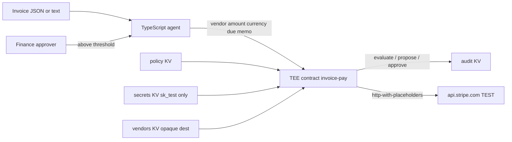

# Trusted invoice-pay agent (T3N)

Superteam Earn listing: **t3n-agent-build-challenge**.

A small finance-team agent: take a vendor invoice → check a USD approval policy → pay through a TEE contract on Terminal 3 sandbox → write an audit row.

No bank account numbers. No API secrets in the model prompt. Stripe **TEST** only (`sk_test_`). No production cluster.

## Why T3N

Invoice payment is the same class of problem as T3’s payroll / procurement stories: the agent must *propose* a payment without ever holding treasury credentials or vendor bank details.

| Concern | How this repo uses T3N |
|---|---|
| Agent identity | `did:t3n:…` from an authenticated session (never derived locally) |
| Secrets | `z:<tid>:secrets` via `maps.entrySet`; contract reads them inside the enclave |
| Vendor destinations | `z:<tid>:vendors` — opaque Stripe refs, not account numbers |
| Last-mile HTTP | `http-with-placeholders` so finance-team email is `{{profile.verified_contacts.email.value}}` |
| Policy | Human approval above `$500` USD (configurable) |
| Pause | `tenant.contracts.disable("invoice-pay")` |

We implement against the public ADK docs and the **installed** `@terminal3/t3n-sdk` types. Where those disagree, the SDK wins and the mismatch is in [`docs/DX_AND_BUGS.md`](docs/DX_AND_BUGS.md).

## Known live blocker

On 2026-09-02, `npx tsx src/quickstart.ts` with a real claimed sandbox `T3N_API_KEY` died **before handshake** on `@terminal3/t3n-sdk@5.7.0` (Node 20.19.2):

```
Error: Trust manifest at https://cn-api.sg.testnet.t3n.terminal3.io/api/trust-manifest is malformed.
```

`fetchTrustedManifest("sandbox")` and `fetchTrustedManifest("testnet")` both throw. The URL is HTTP 200 JSON (518 bytes) with `cluster`, `version`, `peer_ids`, `rtmr3_allowlist`, `signed_at`, `signature` — and **no** `rtmr1_allowlist`, which the SDK types require. This is not a missing-key problem. We did not fake a successful authenticate. Details: [`docs/DX_AND_BUGS.md`](docs/DX_AND_BUGS.md).

The rest of the repo (invoice parse, policy, TEE contract, register/invoke scripts) is still the intended architecture once T3 republishes a manifest 5.7.0 will accept.

## Architecture



Sensitive substitution:

- Stripe secret: **KV read inside WASM** (host WIT rejects `{{secrets.*}}`).
- Receipt email: **`{{profile.*}}`** resolved in the TEE, not in the agent.
- Bank numbers: **not accepted on the invoice**. Store an `acct_…` in `vendors` if you need a destination.

## Judge path (under 15 minutes)

Needs Node 18+, Rust **1.85+** (edition 2024 crates pulled by `wit-bindgen` 0.49) with the `wasm32-wasip2` target (see [Set Up Dev Env](https://docs.terminal3.io/developers/adk/get-started/prerequisites/set-up-dev-env.md)), and a key from the [claim page](https://www.terminal3.io/claim-page). `contracts/rust-toolchain.toml` selects `stable`.

```bash
git clone https://github.com/louist369/t3n-trusted-invoice-agent.git
cd t3n-trusted-invoice-agent
npm install
export T3N_API_KEY="0x…"   # do not commit this
npx tsx src/quickstart.ts
# Connected as: did:t3n:abcd1234…
# TenantClient ready.

npm run build:contract
npx tsx scripts/register.ts
npx tsx scripts/invoke.ts --invoice examples/invoice.json
npx tsx src/agent.ts --invoice examples/over-threshold.json
# Human approval required. Re-run with --approve after review.
```

Optional Stripe TEST last mile:

```bash
export STRIPE_SECRET_KEY="sk_test_…"   # never sk_live_
npx tsx scripts/register.ts            # bump CONTRACT_VERSION if already registered
npx tsx scripts/invoke.ts --invoice examples/invoice.json
```

Unit tests (no network):

```bash
npm test
```

## Repo map

| Path | Role |
|---|---|
| `src/quickstart.ts` | First authenticated call (`sandbox`) |
| `src/agent.ts` | Agent DID helpers + invoice workflow |
| `src/invoice.ts` | Parse JSON/text; reject bank/secret fields |
| `contracts/` | WIT + Rust TEE contract |
| `scripts/build.sh` | `cargo build --target wasm32-wasip2 --release` |
| `scripts/register.ts` | Register WASM, maps, seed policy |
| `scripts/invoke.ts` | Grant + evaluate + propose (+ execute) |
| `scripts/pause.ts` | Disable / enable the contract |
| `docs/operator.md` | One-page runbook |
| `docs/DX_AND_BUGS.md` | Docs/SDK friction (judged) |

Cluster is always **`setEnvironment("sandbox")`**. Not production.

## Handover — we want Terminal 3 to operate this

After the challenge we prefer **Terminal 3** to run this agent (hand over), not a leftover hackathon laptop.

### 1. Environment

| Variable | Who holds it | Notes |
|---|---|---|
| `T3N_API_KEY` | T3 operator | Tenant / org-admin key from the claim page |
| `AGENT_KEY` | T3 operator | Optional second claim-page key (own credits) |
| `USER_KEY` | Finance data owner | Signs `agent-auth-update`; omit = self-grant |
| `STRIPE_SECRET_KEY` | Finance / T3 | `sk_test_` only; seeded into `secrets` |
| `APPROVAL_THRESHOLD_USD` | Finance | Default `500` |
| `CONTRACT_VERSION` | Operator | Bump on every re-register |

### 2. Rotate the API key

The claim-page key is an Ethereum private key. A **new** claim-page key is a **new** DID and a new credit balance.

- Sandbox / demo: claim a replacement key, re-run `quickstart` + `register` (new `contract_id` → re-ACL maps) + re-grant egress.
- Keep the same DID: use `addAuthMethod` on the live session, then stop using the old key. Do not paste either key into chat, tickets, or this repo.
- Org-owned agents (`t3n agent create --org …`) return a one-time `t3n_key_…`. Store it in the operator secret manager; it cannot be recovered.

### 3. Where the contract lives

- Tail: `invoice-pay` → canonical `z:<tid>:invoice-pay`
- `<tid>` is `tenantDid.slice("did:t3n:".length)` from the session, never hardcoded
- Numeric `contract_id` is printed by `scripts/register.ts` and stored in gitignored `.t3n-state.json`
- Sandbox node (SDK 5.7.0): `https://cn-api.sg.testnet.t3n.terminal3.io`

### 4. Pause the agent

```bash
npx tsx scripts/pause.ts                 # contracts.disable
# and/or
npx @terminal3/t3n-sdk agent card-unpublish --env sandbox
# and/or remove api.stripe.com from the user's agent-auth-update grant
```

Resume: `npx tsx scripts/pause.ts --resume`.

Operator detail: [`docs/operator.md`](docs/operator.md).
